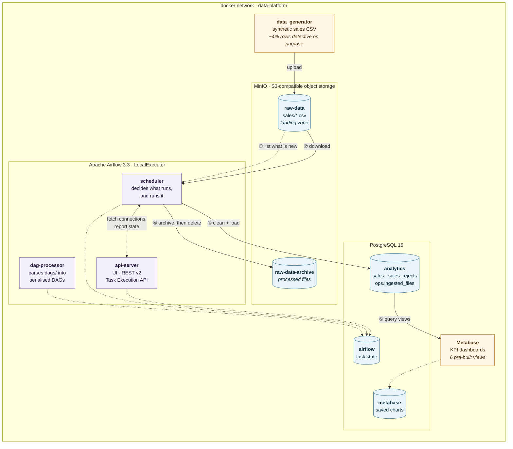
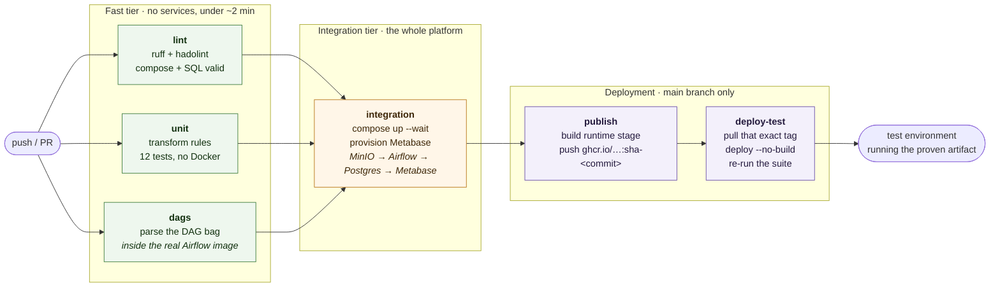

# Mini Data Platform (Dockerized)

[](https://github.com/Latiah/CI_CD_Workflows_Data_platform/actions/workflows/main.yml)

An end-to-end data platform run entirely by Docker Compose. Synthetic sales data
lands in object storage, Airflow cleans and loads it into a relational
warehouse, and Metabase charts the result — with CI/CD that proves the whole
path still works on every commit.



Solid arrows are the data path; dotted arrows are control and bookkeeping.

| Component | Technology | Purpose | URL |
| :-- | :-- | :-- | :-- |
| Database | PostgreSQL 16 | Structured storage for processed data | `localhost:55432` |
| Processing | Apache Airflow 3.3 | Orchestration and pipeline execution | http://localhost:18080 |
| Storage | MinIO | S3-compatible object storage for raw CSVs | http://localhost:19001 |
| Dashboards | Metabase | Charts and reporting | http://localhost:13000 |

---

## Quick start

```bash
cp .env.example .env         # every value has a working default
./scripts/gen_secrets.sh     # replace the public placeholder secrets

make up                      # build and start, waiting until all services are healthy
make metabase                # create the admin user and connect the warehouse
make seed                    # drop a batch of synthetic sales into MinIO
```

Airflow picks the file up within ten minutes on its own schedule. To see it
immediately, trigger the **`sales_ingestion`** DAG at http://localhost:8080, then:

```bash
docker compose exec postgres psql -U platform -d analytics -c "SELECT * FROM analytics.v_kpi_summary;"
```

**Default credentials** — change them for anything but local use:
Airflow `airflow`/`airflow` · MinIO `minioadmin`/`minioadmin` ·
Metabase `admin@example.com`/`Metabase123!` · PostgreSQL `platform`/`platform`

---

## Commands

Every target works locally and is what CI runs, so the two cannot drift.

| Command | What it does |
| :-- | :-- |
| `make up` / `make down` / `make clean` | Start (waits for healthy) / stop / stop and wipe volumes |
| `make test` | Unit tests — fast, no Docker |
| `make lint` | Ruff + hadolint (containerised) |
| `make validate` | Compose file and SQL bootstrap |
| `make e2e` | End-to-end data flow, needs `make up` first |
| `make smoke` | up + provision + seed + validate, in one go |
| `make seed` / `make metabase` | Generate a data batch / provision Metabase |

```bash
pip install -r requirements-dev.txt   # one toolchain for local and CI
```

---

## How it works

**Infrastructure** — all services live in
[docker-compose.yml](docker-compose.yml) on one bridge network, so Airflow
reaches MinIO and PostgreSQL by service name. Five named volumes persist across
`docker compose down`. One Postgres instance hosts three logical databases:
`airflow` (metadata), `analytics` (the warehouse) and `metabase` (BI app state).
Airflow's connections are injected as `AIRFLOW_CONN_*` environment variables, so
a fresh stack needs no manual setup in the UI.

**Ingestion** — [data_generator/](data_generator/) produces synthetic sales
orders and uploads a CSV to `s3://raw-data/sales/`. About 4% of rows are
**deliberately defective**, so the cleaning stage has real work to do and the
tests have something to assert on.

**Orchestration** — [dags/sales_ingestion_dag.py](dags/sales_ingestion_dag.py),
scheduled every 10 minutes:

1. **`list_new_files`** — lists the bucket, subtracts what `ops.ingested_files`
   already records
2. **`process_file`** — mapped over each new object (4 at a time): download →
   clean → load → archive
3. **`summarise`** — totals the run and refreshes statistics for Metabase

**Cleaning rules**, in [src/pipeline/transform.py](src/pipeline/transform.py) —
deliberately free of Airflow imports so they unit test in milliseconds:

| Rule | Behaviour |
| :-- | :-- |
| Whitespace / casing | Trimmed; regions title-cased, channels mapped to a canonical set |
| Required fields | Rows missing `order_id`, `region`, `product` etc. are rejected |
| Timestamps | Parsed to UTC; unparseable values rejected |
| Numerics | `quantity > 0`, `unit_price >= 0`, `0 <= discount_pct < 1` |
| Duplicates | First occurrence of an `order_id` wins within a batch |
| Derived | `order_date`, `gross_amount`, `net_amount` |

Rejected rows are **not dropped** — they go to `analytics.sales_rejects` with a
reason and the original record, so data quality is itself reportable.

**Idempotency** is enforced three ways: `ops.ingested_files` stops a file being
consumed twice, `ON CONFLICT DO NOTHING` stops duplicate orders, and processed
objects move to an archive bucket. Re-run the DAG as often as you like — row
counts do not move.

<details>
<summary><b>Warehouse schema</b></summary>

[config/postgres/init/](config/postgres/init/) defines:

- `analytics.sales` — the fact table, keyed on `order_id`, with check
  constraints mirroring the transform rules and indexes on date, region,
  category and source file
- `analytics.sales_rejects` — quarantined rows with their rejection reason
- `ops.ingested_files` — which object, how many rows in, loaded, rejected, and
  under which DAG run

</details>

---

## Dashboards

`make metabase` creates the admin account and registers the `analytics`
database over the API — idempotent, so re-running just re-syncs the schema.
Six views are ready to chart at http://localhost:3000:

| View | Suggested visualization |
| :-- | :-- |
| `v_kpi_summary` | Number cards — revenue, orders, customers, AOV |
| `v_daily_sales` | Line chart of revenue over time |
| `v_sales_by_region` | Bar or map chart with revenue share |
| `v_top_products` | Row chart, top 10 by revenue |
| `v_channel_performance` | Stacked area chart by channel |
| `v_pipeline_health` | Table — files ingested and their accept rate |

**+ New → Question → Mini Data Platform → analytics →** pick a view, then
**Save → Add to a dashboard**.

---

## CI/CD

[.github/workflows/main.yml](.github/workflows/main.yml) runs six jobs in
three tiers — fast checks first, then the real stack, then deployment:



A failure in the fast tier stops everything before a single container starts,
and nothing is published unless data has actually moved end to end.

The six jobs in detail:

| Tier | Job | What it does |
| :-- | :-- | :-- |
| Fast | **lint** | `make lint` + `make validate` |
| Fast | **unit** | `make test` — no Docker needed |
| Fast | **dags** | Parses the DAG bag inside the real Airflow image |
| Integration | **integration** | Stands the stack up and asserts data moves `MinIO → Airflow → PostgreSQL → Metabase` |
| Deploy | **publish** | Pushes the `runtime` image to GHCR tagged `sha-<commit>` |
| Deploy | **deploy-test** | Pulls that exact tag, deploys `--no-build`, re-runs the suite |

Three design points:

- **CI runs the same `make` targets you do**, so a green `make lint test`
  locally means the pipeline ran identical commands.
- **`--wait` replaces a polling loop** — it fails fast if a service never
  becomes healthy, instead of letting tests queue against a dead scheduler.
- **The deploy tests the artifact, not the source.** Tagging by commit sha and
  deploying `--no-build` is what stops a pipeline going green while the
  environment runs older code.

<details>
<summary><b>What the end-to-end suite asserts</b></summary>

[tests/integration/test_data_flow.py](tests/integration/test_data_flow.py)
uploads a seeded 750-row batch, triggers the DAG over the REST API (Airflow 3
drops Basic auth, so it exchanges credentials for a JWT at `/auth/token`), then
asserts:

- `analytics.sales` holds **exactly** the row count the transform predicted —
  computed independently, not read back from the database
- `ops.ingested_files` recorded the run, and `loaded + rejected == raw`
- Defective rows landed in `sales_rejects` rather than vanishing
- `gross_amount` / `net_amount` arithmetic holds across the table
- All six KPI views return rows
- The processed object was archived out of the landing zone
- The Metabase API is healthy with the warehouse registered
- A re-run inserts nothing new (idempotency)

</details>

<details>
<summary><b>Deployment setup and failure diagnostics</b></summary>

`publish` needs no configuration — it uses the built-in `GITHUB_TOKEN`.
`deploy-test` needs a **`test` environment** under Settings → Environments; it
can be empty, but the job fails immediately if it does not exist. Adding
required reviewers there turns the deploy into a gated release.

On failure, the `integration` job writes a service-state table to the run
summary and uploads a `compose-logs-<run_id>` artifact containing `compose.log`,
`ps.txt` (with per-container `oom=true/false`, since a container killed for
memory leaves nothing in its own log) and `tasks.log`. The suite also pulls a
failed task's Airflow log into the pytest output, so the common case needs no
artifact download.

</details>

---

## Troubleshooting

| Symptom | Cause and fix |
| :-- | :-- |
| `mdp-airflow-apiserver is unhealthy` | Memory. The stack needs ~4 GB of Docker. On Windows, WSL takes half the host by default — create `%USERPROFILE%\.wslconfig` with `[wsl2]` / `memory=5GB`, then `wsl --shutdown` and restart Docker Desktop |
| DAG never appears in the UI | Check the dag-processor, not the scheduler: `docker compose exec airflow-dag-processor airflow dags list-import-errors`. A DAG with an import error is simply absent |
| DAG run does nothing | Correct when MinIO holds no new files. Run `make seed` first |
| Port already in use | Override `POSTGRES_PORT`, `AIRFLOW_PORT`, `METABASE_PORT`, `MINIO_API_PORT` in `.env`, and point the tests at the same ports |
| Airflow logs unwritable (Linux) | Set `AIRFLOW_UID=$(id -u)` in `.env`. Not needed on Docker Desktop |
| MinIO images pull from `quay.io` | Deliberate — Docker Desktop's default image-access policy blocks the `minio/*` Docker Hub repositories |
| Start completely fresh | `make clean` removes every volume, including the warehouse |

---

## Repository structure

```text
├── dags/                        # Airflow DAG definitions
├── data_generator/              # Synthetic sales data generator
├── src/pipeline/                # Transform + warehouse logic (Airflow-free, testable)
├── config/postgres/init/        # Database and warehouse schema bootstrap
├── docker/                      # Dockerfiles (runtime + test stages)
├── scripts/                     # Metabase provisioning, secret generation
├── tests/unit/                  # Transform rules and DAG integrity
├── tests/integration/           # End-to-end data flow validation
├── .github/workflows/main.yml   # CI/CD pipeline
├── docker-compose.yml           # Platform orchestration
├── Makefile                     # The entry point CI and humans share
├── requirements-dev.txt         # One toolchain for local and CI
└── .env.example                 # Configuration template
```
